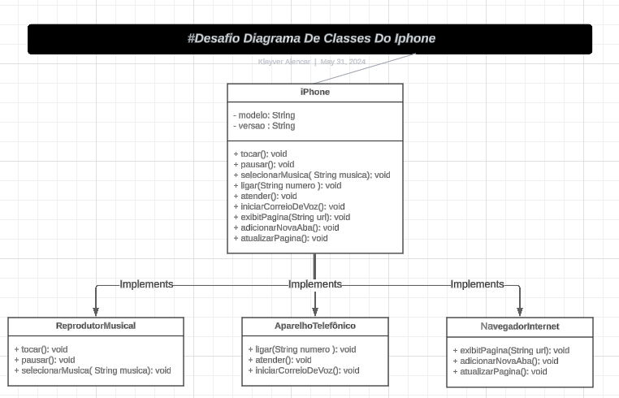

# Desafio POO Java - DIO

## Descrição

Este projeto é um desafio de Programação Orientada a Objetos (POO) proposto pela Digital Innovation One (DIO). O objetivo é modelar e diagramar um componente iPhone, abrangendo suas funcionalidades como Reprodutor Musical, Aparelho Telefônico e Navegador na Internet.

## Funcionalidades Modeladas

- **Reprodutor Musical**
  - `tocar()`
  - `pausar()`
  - `selecionarMusica(String musica)`

- **Aparelho Telefônico**
  - `ligar(String numero)`
  - `atender()`
  - `iniciarCorreioVoz()`

- **Navegador na Internet**
  - `exibirPagina(String url)`
  - `adicionarNovaAba()`
  - `atualizarPagina()`

## Estrutura do Projeto

```plaintext
desafio_poo_java/
├── diagrams/
│ └── iphone_uml_diagram.png
└── src/
└── com/
└── digitalinnovation/
└── desafio/
└── poo/
└── java/
├── AparelhoTelefonico.java
├── IPhone.java
├── NavegadorInternet.java
└── ReprodutorMusical.java


## Diagrama UML IPHONE


